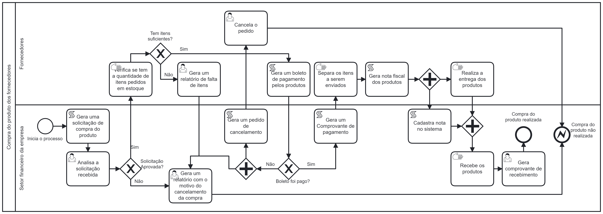
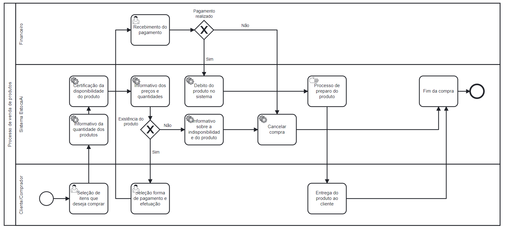
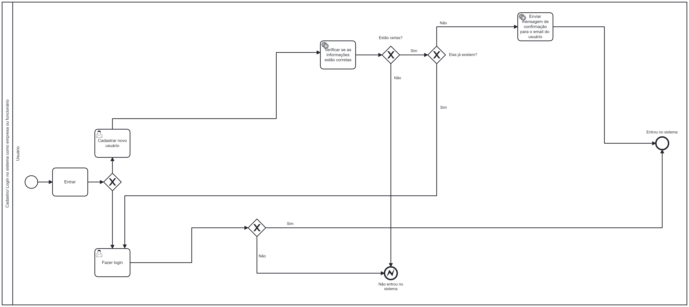
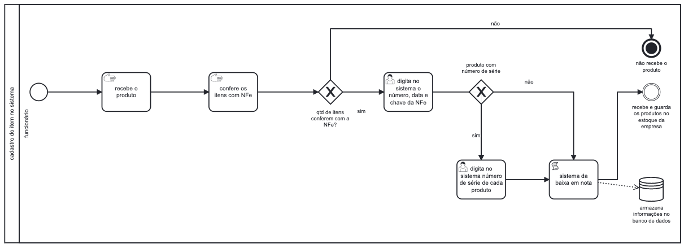
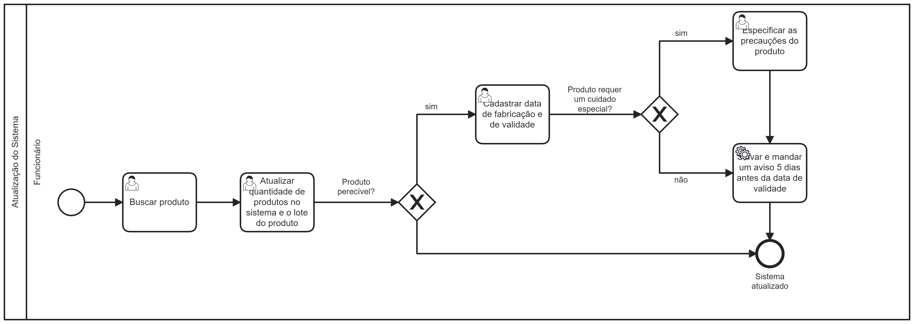
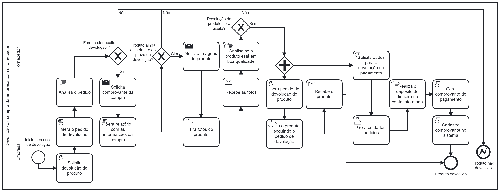
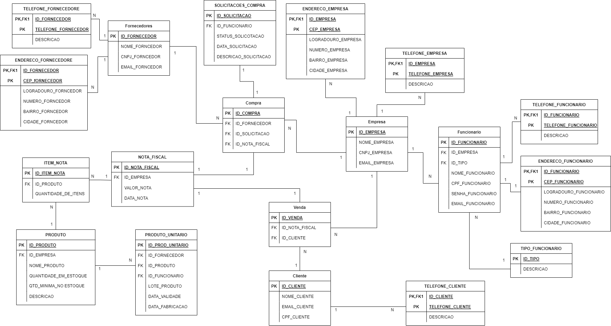

# EstocaAI

**Caio Elias Rodrigues Araujo, caio.araujo.1402746@sga.pucminas.br**

**Lucas Nogueira Mazzieiro de Carvalho, lnmcarvalho@sga.pucminas.br**

**Philippe Roberto Dutra Chaves Vieira, philippe.vieira@sga.pucminas.br**

**Luís Henrique do Amaral Gomes, lhagomes@sga.pucminas.br**

**Henrique Jardim Melo, henriquejardimm@gmail.com**

---

Professores:

**Prof. Cleiton Silva Tavares** 
**Prof. Felipe Augusto Lima Reis** 
**Prof. Hugo Bastos de Paula**

---

_Curso de Engenharia de Software, Unidade Praça da Liberdade_

_Instituto de Informática e Ciências Exatas – Pontifícia Universidade de Minas Gerais (PUC MINAS), Belo Horizonte – MG – Brasil_

---

**Resumo:**  O trabalho é baseado em um sistema de gerenciamento de estoque, cujo o objetivo principal é criar uma plataforma com o intuito de auxiliar empresas de pequeno e grande porte. Nessa plataforma, os clientes poderão gerenciar o seu estoque, administrar seus funcionários e ter controle da compra e venda de seus produtos. 
---

## 1. Introdução

Este projeto está sendo desenvolvido no ambiente acadêmico da PUC-Minas, e tem como foco principal o desenvolvimento de uma plataforma online que dará suporte no gerenciamento de empresas.

    1.1 Contextualização

Observando o cenário atual,é possível perceber que diversas empresas acabam sendo prejudicadas devido à falta de ferramentas seguras e precisas que as ajudem a se gerenciar de uma maneira correta.

    1.2 Problema

A falta de uma ferramenta de gerenciamento de estoque pode causar diversos problemas, dentre eles:
- Indisponibilidade de produto de alta demanda e excesso de produto de baixa demanda.
- Estoque desatualizado com dados divergentes.
- Falta do status da mercadoria, como o status da validade e o estágio do transporte.
- Processos manuais que podem gerar erros.
- Ineficiência e lentidão no atendimento do cliente. 

    1.3 Objetivo geral

Criar um sistema conectado a um banco de dados com o intuito de facilitar e regularizar o processo de funcionamento de uma empresa.

        1.3.1 Objetivos específicos

Sistema gerencial para compra de produtos de fornecedores, sistema para cadastro dos produtos no banco de dados, sistema para cadastro de funcionários e sistema de vendas dos produtos cadastrados.

    1.4 Justificativas

Ajudar empresas por meio da criação de uma plataforma gratuita e de fácil utilização, sem perder a qualidade do processo, evitando, assim, os problemas citados anteriormente.

## 2. Participantes do processo

- Fornecedores
- Donos/ Proprietários da empresa
- Funcionários 
- Clientes 
- Empresas responsáveis pelo transporte das mercadorias

## 3. Modelagem do processo de negócio

## 3.1. Análise da situação atual

O processo atual ocorre da seguinte maneira:
1. A empresa liga para os fornecedores e agenda a compra da quantidade desejada de determinado produto.
2. Os funcionários dessa empresa cadastram os produtos que foram comprados em seu estoque, através de uma planilha excel.
3. Em caso de venda, o funcionário da baixa do produto,na planilha de estoque, e gera o comprovante de venda para o cliente.
4. Quando a quantidade do produto em estoque chegar a um número mínimo, uma nova compra é agendada com o fornecedor.
5. Caso um produto precisa ser devolvido, o funcionário precisa procurar, dentre vários outros comprovantes, aquele que é referente a este produto.

A partir do uso do nosso projeto, as etapas listadas serão feitas de forma automática e precisa, diminuindo, assim, os erros e a ineficiência do processo atual.

## 3.2. Descrição Geral da proposta

A nossa proposta é criar uma plataforma que ajuda com a logística das empresas, que usassem a nossa plataforma, estruturando o seu modelo de negócio para o padrão mais eficiente presente no mercado. Dessa forma, gerenciaremos todo o processo, desde a compra dos produtos com os fornecedores até a venda para os clientes.  
No lado dos fornecedores, iremos controlar as solicitações de compra (caso o produto esteja em baixa quantidade no estoque), o processo da entrega do produto até a empresa e o cadastro destes no sistema quando chegarem. 
Já do lado dos clientes desta empresa, iremos gerenciar o processo de venda dos produtos, gerando uma nota fiscal e dando a baixa do produto vendido no sistema. 
Temos o intuito de criar algo que seja de fácil entendimento e utilização, para solucionar os problemas de companhias que não estão 100% estruturadas.

## 3.3. Modelagem dos Processos

### 3.3.1 Processo 1 – Compra do produto dos fornecedores.

Processo de compra de um produto com os fornecedores, vai desde a geração da solicitação de compra até a entrega (ou não) do produto.

### 3.3.2 Processo 2 – Venda de Produtos para o Cliente.

A imagem a seguir representa o processo de venda de produtos para clientes, partindo do estoque do sistema EstocaAi. Tal sistema visa agilizar, organizar e maximizar o número de entregas a fins de elevar os lucros não só do sistema EstocaAi, quanto de empresas clientes do processo;

### 3.3.3 Processo 3 – Cadastro/ Login no sistema como empresa ou funcionário

Na modelagem do processo de cadastro/ Login no sistema, é possivel perceber que há o caminho de uma pessoa que está entrando no site pela primeira vez e outro de um usuário que já ossui uma conta.  Além disso, há a opção de se cadastrar como funcinário ou como uma empresa. 

Esse processo é prático e feito em poucos minutos, ajudando, assim, no cotidiano de quem o utiliza.

### 3.3.4 Processo 4 – Cadastro do produto no sistema.

Apresente aqui o nome e as oportunidades de melhorias para o processo 4. Em seguida, apresente o modelo do processo 4, descrito no padrão BPMN.

### 3.3.5 Processo 5 – Atualização de estoque.

No processo de atualização de estoque, há o controle dos produtos que a empresa atualizou no estoque. Esse monitoramento occore por meio das informações que são armazenas, como a data de produção e de validade, lote do produto, quantidade, disponibilidade e também se o produto requer algum cuidado especial.
A partir dessas informações, o supervisionamento sobre as mercadorias se torna mais eficaz e fácil.

### 3.3.6 Processo 6 – Devolução da compra da empresa com o fornecedor.

Processo de devolução da compra que a empresa fez com o fornecedor.

## 4. Projeto da Solução

### 4.1. Detalhamento das atividades

Descrever aqui cada uma das propriedades das atividades de cada um dos processos. Devem estar relacionadas com o modelo de processo apresentado anteriormente.

#### Processo 1 – Compra do produto dos fornecedores.

**Analisa solicitação recebida**
| **Campo** | **Tipo** | **Restrições** | **Valor default** |
| --- | --- | --- | --- |
| ID pedido | Caixa de texto | 10 digitos, número hexadecimal, GERADO AUTOMATICAMENTE | --- |
| Aprovar solicitação | Seleção única | Não pode estar selecionado enquanto o 'Reprovar solicitação' estiver ativo | Ativado |
| Reprovar solicitação | Seleção única | Não pode estar selecionado enquanto o 'Aprovar solicitação' estiver ativo | Desativado |

**Gera um relatório com o motivo de cancelamento**
| **Campo** | **Tipo** | **Restrições** | **Valor default** |
| --- | --- | --- | --- |
| ID pedido | Caixa de texto | 10 digitos, número hexadecimal, PREENCHIDO AUTOMATICAMENTE | --- |
| Motivo | Área de texto | --- | --- |

**Gera um relatório de falta de itens**
| **Campo** | **Tipo** | **Restrições** | **Valor default** |
| --- | --- | --- | --- |
| ID pedido | Caixa de texto | 10 digitos, número hexadecimal, PREENCHIDO AUTOMATICAMENTE | --- |
| Motivo | Área de texto | --- | --- |

**Cancela o pedido**
| **Campo** | **Tipo** | **Restrições** | **Valor default** |
| --- | --- | --- | --- |
| ID pedido | Caixa de texto | 10 digitos, número hexadecimal, PREENCHIDO AUTOMATICAMENTE | --- |
| Cancelar pedido | Seleção única | --- | Ativado |

**Gera comprovante de recebimento**
| **Campo** | **Tipo** | **Restrições** | **Valor default** |
| --- | --- | --- | --- |
| ID pedido | Caixa de texto | 10 digitos, número hexadecimal, PREENCHIDO AUTOMATICAMENTE | --- |
|  Data recebimento | Data | --- | --- |

#### Processo 2 – Venda de Produtos para o Cliente.

**Seleção de itens para compra**

| **Campo** | **Tipo** | **Restrições** | **Valor default** |
| --- | --- | --- | --- |
| Quantidade Produto | Número | --- | --- |
| Confirmação produtos | Seleção Única | --- | --- |

**Seleção forma de pagamento**

| **Campo** | **Tipo** | **Restrições** | **Valor default** |
| --- | --- | --- | --- |
| Seleção Pagamento | Seleção Única | --- | --- |
| Número Cartão | Número | 16 digitos, número decimal | --- |
| Data Validade | Data | 06 digitos, número decimal | --- |
| Número Verificação | Número | 03 digitos, númmero decimal | --- |
| Parcelas | Seleção Única | --- | --- |

#### Processo 3 – Cadastro/ Login no sistema como empresa ou funcionário.

**Cadastrar novo usuário**
| **Campo** | **Tipo** | **Restrições** | **Valor default** |
| --- | --- | --- | --- |
| Nome Completo | Caixa de Texto | Apenas letras | --- |
| CPF | Caixa de Texto | Apenas números e 11 dígitos | --- |
| Senha | Caixa de Texto | Mínimo 8 caracteres; letras maiúsculas e minúsculas; | --- |
|Confirmar Senha | Caixa de Texto | Mesmos caracteres da senha | --- |
| Email | Caixa de Texto | Ter um formato válido de email | --- |

**Fazer login**
| **Campo** | **Tipo** | **Restrições** | **Valor default** |
| --- | --- | --- | --- |
| Email | Caixa de Texto | ser igual a um email ja cadastrado  | --- |
| Senha | Caixa de Texto | ser igual a senha já cadastrada| --- |

#### Processo 4 – Cadastro do produto no sistema.

**Baixa e conferência de NFe's chegadas**
| **Campo** | **Tipo** | **Restrições** | **Valor default** |
| --- | --- | --- | --- |
| Tipo de produto | Caixa de texto autocompleta | Apenas opções indexadas | --- |
| Nome | Caixa de texto | Apenas textto e números | --- |
| Código do produto | Números | Apenas números | --- |
| Categoria | Caixa de texto autocompleta | Apenas opçòes indexadas | --- |
| Nota Fiscal | Número | Apenas números e 44 dígitos | --- |
|  Data  |   Número |  Apenas números e data autocompleta   | | --/--/---- |
| Preço | Número | Apenas números | --- |
| Quantidade | Número | Apenas números | --- |
| Descrição | Caixa de texto | Caixa de texto ilimitado | --- |

**Nome da atividade 2**

| **Campo** | **Tipo** | **Restrições** | **Valor default** |
| --- | --- | --- | --- |
| [Nome do campo] | [Área de texto, Caixa de texto, Número, Data, Imagem, Seleção única, Múltipla escolha, Arquivo, Link, Tabela] |  |  |
|    |    |     |

#### Processo 5 – Cancelamento da compra feita pelo cliente com a empresa.

**Especificar as informações do produto**
| **Campo** | **Tipo** | **Restrições** | **Valor default** |
| --- | --- | --- | --- |
| Observação | Caixa de Texto | 256 caracteres | --- |

**Cadastrar data de facricação e de validade**
| **Campo** | **Tipo** | **Restrições** | **Valor default** |
| --- | --- | --- | --- |
| Data Fabricação | Caixa de Texto | Apenas números e 8 dígitos | --- |
| Data Validade | Caixa de Texto | Apenas números e 8 dígitos | --- |

#### Processo 6 – Devolução da compra da empresa com o fornecedor.

**Solicita devolução do produto**
| **Campo** | **Tipo** | **Restrições** | **Valor default** |
| --- | --- | --- | --- |
| Devolver Produto | Seleção única | --- | --- |
| Motivo | Área de texto | --- | --- |

**Gera pedido de devolução do produto**
| **Campo** | **Tipo** | **Restrições** | **Valor default** |
| --- | --- | --- | --- |
| Endereço Remetente | Área de texto | --- | --- |
| CEP Remetente | Área de texto | CEP Válido | --- |
| Endereço Destinatário | Área de texto | --- | --- |
| CEP Destinatário | Área de texto | CEP Válido | --- |
| Peso do pacote | Número | --- | --- |

**Gera os dados pedidos**
| **Campo** | **Tipo** | **Restrições** | **Valor default** |
| --- | --- | --- | --- |
| Agencia | Caixa de texto | Somente número, 4 dígitos| --- |
| Conta | Caixa de Texto | Pode conter números alfanuméricos | --- |
| CPF/CNPJ | Caixa de Texto | Formato válido de CPF ou CNPJ | --- |
| Nome Completo | Caixa de Texto | Apenas letras | --- |

### 4.2. Tecnologias

Descreva qual(is) tecnologias você vai usar para resolver o seu problema, ou seja implementar a sua solução. Liste todas as tecnologias envolvidas, linguagens a serem utilizadas, serviços web, frameworks, bibliotecas, IDEs de desenvolvimento, e ferramentas. Apresente também uma figura explicando como as tecnologias estão relacionadas ou como uma interação do usuário com o sistema vai ser conduzida, por onde ela passa até retornar uma resposta ao usuário.

- HTML
- CSS
- JavaScript
- Camunda
- NodeJS

## 5. Modelo de dados

Apresente o modelo de dados por meio de um modelo relacional ou Diagrama de Entidade-Relacionamento (DER) que contemple todos conceitos e atributos apresentados item anterior. 

## 6. Indicadores de desempenho

| **Indicador** | **Objetivos** | **Descrição** | **Cálculo** | **Fonte dados** | **Perspectiva** |
| --- | --- | --- | --- | --- | --- |
| Cadastro de novos clientes | Avaliar o número de novos clientes registrados|Quantidade de novos clientes dado um determinado tempo||TABELA EMPRESA| Aprendizado e Crescimento |
| Vendas de determinado produto |Avaliar o número de vendas registradas para determinado produto|Calcula a diferença de vendas de um produto por intervalo de tempo||TABELA VENDA|Financeiro|
| Vendas Totais |Avaliar o número de vendas registradas|Calcula a diferença de vendas por intervalo de tempo||TABELA VENDA|Financeiro|
| Compras de determinado produto |Avaliar o número de compras registradas para determinado produto|Calcula a diferença na compra de um porduto por intervalo de tempo||TABELA COMPRA |Financeiro|
| Compras Totais |Avaliar o número de compras registradas|Calcula a diferença na compra por intervalo de tempo||TABELA COMPRA |Financeiro|
| Lucro Obtido |Avaliar o lucro obtido pela empresa|Calcula a diferença entre o valor total de vendas com o de compras||TABELAS VENDA E COMPRA|Financeiro|
| Solicitações de compra em relação com compras realizadas|Avaliar o número de solicitações de compra que geraram compras|Calcula quantas solicitações de compra foram aprovadas||TABELA SOLICITACOES_COMPRA|Aprendizado e Crescimento|
| Cadastro de produtos em relação ao número de produtos comprados |Avaliar se o número de produtos cadastrados é o mesmo que os que foram comprados |Calcula a diferença entre o número de itens comprados com o número de itens cadastrados||TABELAS PRODUTO_UNITARIO e ITEM_NOTA|Processos internos |
| Ranking do funcionarios mais ativos |Classificar os funcionários pro número de atividades realizadas |Conta o número de atividades realizadas por cada funionário e classifica eles em ordem decrescente||TABELAS FUNCIONARIO, PRODUTO_UNITARIO E SOLICITACOES_COMPRA|Processos internos |

Obs.: todas as informações para gerar os indicadores devem estar no diagrama de classe **a ser proposto**

## 7.Sistema desenvolvido

A nossa plataforma, estocaAI, tem como objetivo principal auxiliar empresas de diversos setores do mercado. Nesse software, os clientes poderão gerenciar o seu estoque, administrar seus funcionários e ter controle da compra e venda de seus produtos. Essas funções se encontram nas seguintes telas:
coloque as principais telas com uma explicação de como usar cada uma.

## 8. Conclusão

A partir de alguns estudos prévios, percebemos que muitas empresas sofrem pela falta de um controle de estoque adequado, muita das vezes devido à falta de uma ferramenta de fácil utilização e entendimento. Partindo desse ponto, concluímos que a melhor forma de acabar com esse empecilho é por meio de um software capaz 
de resolver os problemas de nossos clientes de maneira intuitiva e prática. Com isso, desenvolvemos o estocaAI, plataforma que pode ser manuseada através de um computador ou celular, e por qualquer funcionário da área.
# REFERÊNCIAS

Como um projeto de software não requer revisão bibliográfica, a inclusão das referências não é obrigatória. No entanto, caso você deseje incluir referências relacionadas às tecnologias, padrões, ou metodologias que serão usadas no seu trabalho, relacione-as de acordo com a ABNT.

Verifique no link abaixo como devem ser as referências no padrão ABNT:

http://www.pucminas.br/imagedb/documento/DOC\_DSC\_NOME\_ARQUI20160217102425.pdf

**[1.1]** - _ELMASRI, Ramez; NAVATHE, Sham. **Sistemas de banco de dados**. 7. ed. São Paulo: Pearson, c2019. E-book. ISBN 9788543025001._

**[1.2]** - _COPPIN, Ben. **Inteligência artificial**. Rio de Janeiro, RJ: LTC, c2010. E-book. ISBN 978-85-216-2936-8._

**[1.3]** - _CORMEN, Thomas H. et al. **Algoritmos: teoria e prática**. Rio de Janeiro, RJ: Elsevier, Campus, c2012. xvi, 926 p. ISBN 9788535236996._

**[1.4]** - _SUTHERLAND, Jeffrey Victor. **Scrum: a arte de fazer o dobro do trabalho na metade do tempo**. 2. ed. rev. São Paulo, SP: Leya, 2016. 236, [4] p. ISBN 9788544104514._

**[1.5]** - _RUSSELL, Stuart J.; NORVIG, Peter. **Inteligência artificial**. Rio de Janeiro: Elsevier, c2013. xxi, 988 p. ISBN 9788535237016._

# APÊNDICES

**Colocar link:**

Do código (armazenado no repositório);

Dos artefatos (armazenado do repositório);

Da apresentação final (armazenado no repositório);

Do vídeo de apresentação (armazenado no repositório).

